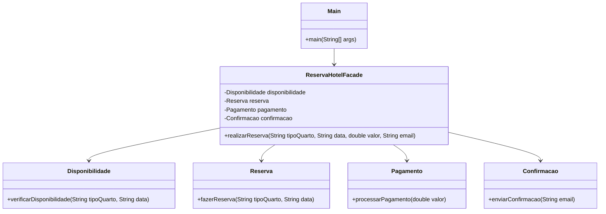

# Padrão Facade

## Intenção
Uma interface única que reúne várias interfaces de um subsistema. A fachada simplifica o uso do subsistema, tornando-o mais acessível.

## Motivação

Em um sistema de reservas de hotel, o cliente precisa interagir com vários subsistemas, como verificar a disponibilidade de quartos, fazer a reserva, processar o pagamento e enviar a confirmação. O padrão Facade simplifica esse processo, fornecendo uma interface única para o cliente realizar uma reserva sem precisar conhecer os detalhes de cada subsistema.

## Diagrama UML

## Explicação do Código

### 1. Criamos a classe `ReservaHotelFacade`  
Ela encapsula a complexidade dos subsistemas e coordena o processo de reserva.

### 2. Subsistemas

- **Disponibilidade:** Verifica se o quarto solicitado está disponível na data desejada.  
- **Reserva:** Realiza a reserva do quarto para o cliente.  
- **Pagamento:** Processa o pagamento da reserva. Neste exemplo, o pagamento sempre é bem-sucedido.  
- **Confirmação:** Envia um e-mail de confirmação para o cliente após a reserva ser concluída.  

### 3. Cliente (Main)

O cliente interage apenas com a fachada (`ReservaHotelFacade`), chamando o método `realizarReserva`. Não precisa conhecer os detalhes internos dos subsistemas.

## Participantes

### **ReservaHotelFacade (Facade)**:
- Fornece uma interface simplificada para o cliente.
- No código: Classe `ReservaHotelFacade`.

### **Disponibilidade, Reserva, Pagamento, Confirmacao (Subsistemas)**:
- Classes que realizam operações específicas.
- No código: Classes `Disponibilidade`, `Reserva`, `Pagamento` e `Confirmacao`.

### **Main (Cliente)**:
- Usa a interface simplificada fornecida pela `Facade`.
- No código: Classe `Main`.

